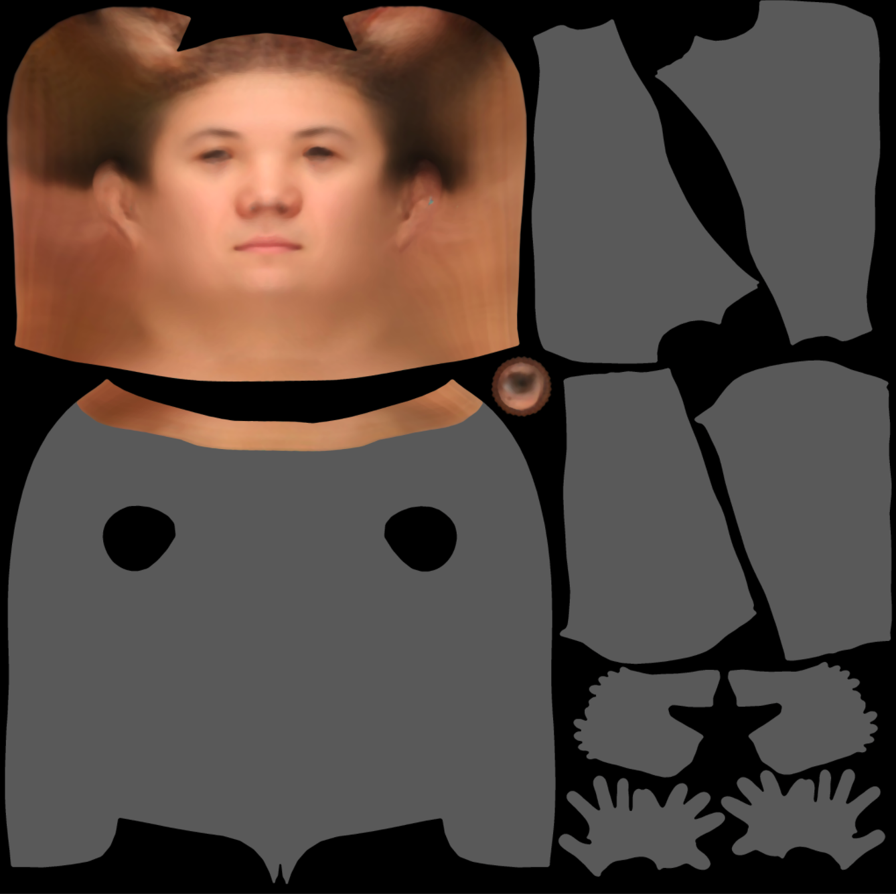

<!--
 * @Date: 2022-02-25 16:42:54
 * @LastEditors: cvhadessun
 * @LastEditTime: 2022-03-10 14:37:55
 * @FilePath: /FLame2SMPLX/README.md
-->
# FLame2SMPLX
A tool to tranform the flame texture space into SMPL or SMPLX model 's head(or face).

This reposity contains:
```
Flame albedo ->smplx/smpl albedo head or face
```

 

## requirement data prepare
- smplx obj file from [smplx blender add-on](https://smpl-x.is.tue.mpg.de) (using other software export the obj model, different from official uv texture obj file.)
- flame obj file from [flame project web](https://flame.is.tue.mpg.de/) (flame uv texture obj file.)
- smplx texture image
- flame texture image
- [smplx to flame vertices crosspondense index file](https://smpl-x.is.tue.mpg.de)
- smplx only face vertices index (extract from smplx model, so following smplx right.)

(if you want to test the demo,you can get all data from official web, or you can email cvhadessun@163.com to get the test data.)

## python-env
```
opencv
tqdm
numpy
```


## usage
- git clone https://github.com/CvHadesSun/FLame2SMPLX
- cd FLame2SMPLX && mkdir data 
- put the test data into data dir
- python main.py
  
```
import cv2
from utils.texture_match import flame_smplx_texture_combine

smplx_obj = "../data/smplx-addon.obj"
flame_obj = "../data/head_template.obj"
smplx_2_flame = "../data/SMPL-X__FLAME_vertex_ids.npy"
smplx_texture = "../data/smplx_texture_m_alb.png"
flame_texture = "../data/texures.png"

# only face (not head)
face_vertex_ids = "../data/face_vertex_ids.npy"


flame_smplx_texture_combine(flame_obj,smplx_obj,flame_texture,smplx_texture,smplx_2_flame,face_vertex_ids) # if  no face_vertex_ids parameter, whole flame head texture will be processed.

```

## change log
- first version: assign the flame texture into smplx texture space,need to optimize the affine transform to accelerate the process.

## Reference
https://github.com/qzane/textured_smplx
